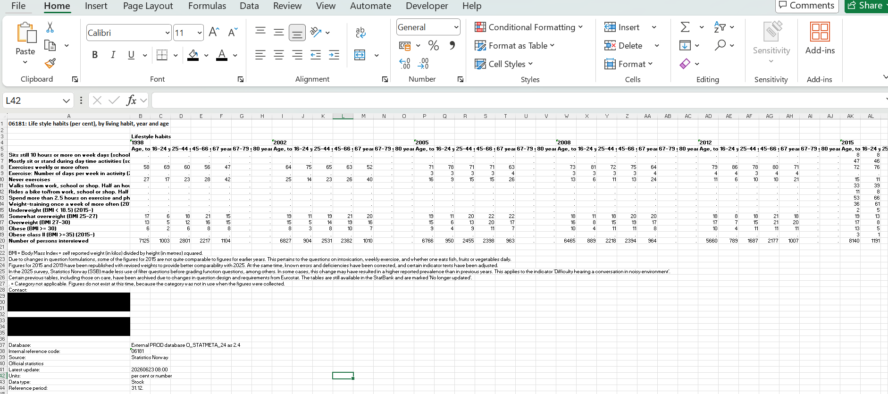
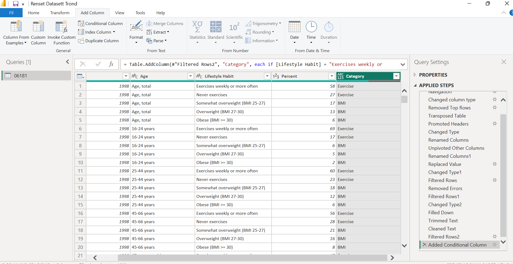
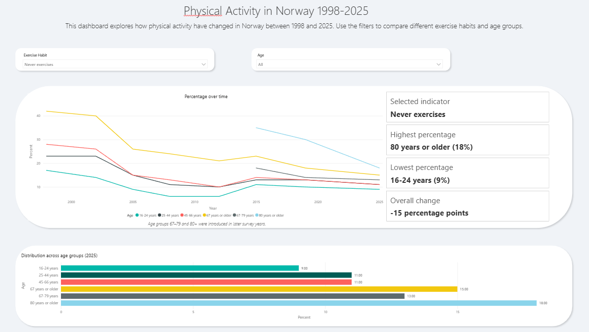
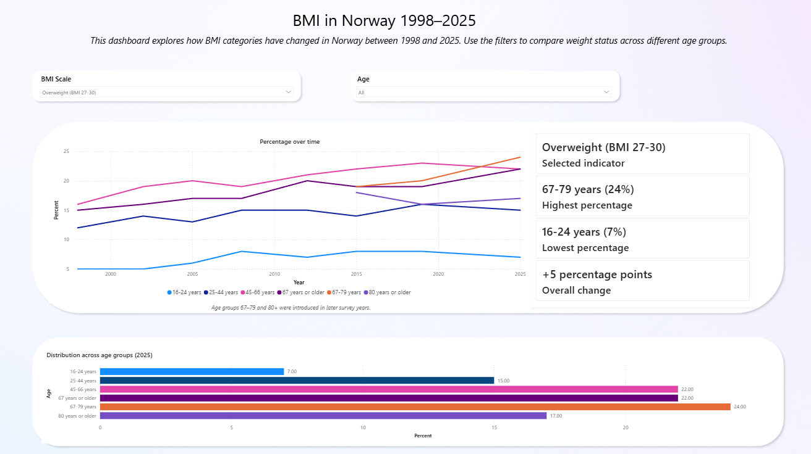

# Physical Activity & BMI Trends in Norway (1998-2025)

## Project Overview

This project was created to improve my skills in data cleaning and data visualization, and to get more experience with real-world data.

The objective was to explore long-term trends in physical activity and Body Mass Index (BMI) in Norway using publicly available data from Statistisk sentralbyrå (SSB).

The project focused on transforming a complex public dataset into an interactive Power BI dashboard through data cleaning, feature engineering, and data visualization.

---

# Project Objectives

The objectives of this project were to:

- Investigate how physical activity levels have changed in Norway between 1998 and 2025.
- Explore trends in BMI categories across different age groups.
- Compare lifestyle indicators between age groups.
- Practice data cleaning and transformation using Power Query.
- Build interactive Power BI dashboards to support exploratory analysis.

---

# Dataset

- **Source:** Statistisk sentralbyrå (SSB) https://www.ssb.no/en/statbank/table/06181
- **Dataset:** Table 06181 – Lifestyle habits (percent), by living habit, year and age
- **Format:** Excel (.xlsx)
- **Data Type:** Public survey data

The dataset contains annual survey data covering physical activity, BMI categories, sedentary behaviour and other lifestyle indicators across multiple age groups.

---

# Data Cleaning

The original dataset required a lot preprocessing before analysis.

The data preparation process included:

- Removing metadata and unnecessary rows
- Unpivoting the dataset into a normalized table
- Renaming and cleaning columns
- Correcting data types
- Removing invalid records
- Creating category fields
- Creating a custom Age Order column for proper visualization sorting

  ## Before Datacleaing
  
  

  ## Cleaned Dataset

  

---

# Dashboards

## 1. Physical Activity Trends

An interactive dashboard was created to explore how different exercise habits have changed over time.

Users can:

- Select exercise indicators
- Compare age groups
- Explore long-term trends
- View dynamic summary statistics
- View changes over time

---

## 2. BMI Trends

A second dashboard was created using the same layout to investigate BMI categories across different age groups.

Users can compare:

- Underweight
- Overweight
- Obesity
- Age-specific trends
- View Changes over time

---

# What the data shows us

## Physical Activity
Between the years 1998 to 2025, the data are indicating an overall improvement in the physical activity across the norwegian population. The proportion of individuals that reported that they exersice "weekly or more often" has increased in almost every age group, while the people that reported that they "never exercises" has also declined over the same period.

Despite this positive trend, there are clear differences between the age groups. younger adults reported consistently the highest levels of weekly exersice and the older age groups showed a lower participation in regular physical activity. The dashboard is also highlighting that despite of the overall inactivity decrease, the older age groups still report the highest proportion of individuals that "never exercises"

Overall, the data shows us a gradual shift towards a more physical active population.

## BMI
The BMI trends are presenting a more mixed picture. While the physical activity level improved over the time period, several BMI categories indicates that there is an increase in overweight and obesity across multiple age groups. The amount of people in the category "Overweight (BMI 27-30)" gradually increased between 1998 and 2025, particularly amonf adults aged 45 years and older. Likewise with the category "Obesity (BMI >30)" showed an upwards trend across the most age groups, with the largest increase in the middle aged adults.

With the introduction of "Obesity Class II (BMI >35)" in 2015, its highlighting that severe obesity although are less common, but continued to increase druing the time period it was available. On the other hand the category "Underweight (BMI<18.5)" remained relatively uncommon amongst the participants, and showed only small changes over the time periods.

## Overall Story
These findings demonstrates that increasing physical activity does not necessarily correspond to a decline of overweight and obesity rates, suggesting that body weight is influenced by multiple factors beyond exercise alone. This contrast shows us the complexity of population health, and that lifestyle outcomes are influenced by a combination of exercise and other factors such as nutrition, aging and other behaviour factors.

# Feature Engineering

Several additional fields were created to improve the dashboards.

Power Query:

- Lifestyle Category
- Age Order
- Cleaned dimensions

DAX:

- Selected Indicator
- Highest Percentage
- Lowest Percentage
- Overall Change Since 1998

These measures update dynamically based on the selected lifestyle indicator.

---

# Tools Used

- Power BI Desktop
- Power Query
- DAX
- Microsoft Excel
- Data Cleaning
- Data Visualization

---

# Key Findings

- Weekly physical activity increased across most age groups between 1998 and 2025.
- The proportion of individuals reporting that they never exercise declined over the study period.
- Younger age groups consistently reported higher levels of regular physical activity than older adults.
- Overweight and obesity became more prevalent across several age groups despite increasing physical activity.
- Severe obesity (BMI ≥35) remained relatively uncommon but increased following its introduction in the survey from 2015.
- The dashboards demonstrate that long-term health trends vary considerably across age groups and lifestyle indicators.

---

# Learning Outcomes

Through this project I improved my experience with:

- Power Query
- Data Cleaning
- Data Transformation
- Feature Engineering
- DAX
- Dashboard Design
- Interactive Data Visualization
- Data Storytelling
- Working with real-world public datasets
  
---

# Disclaimer

This project was created as part of my learning journey in Data Analytics.

The primary objective was to practice data cleaning, data transformation, DAX, and interactive dashboard development using a real-world public dataset from Statistisk sentralbyrå (SSB).

The dashboards were developed for educational and portfolio purposes and should not be interpreted as an official statistical analysis.
